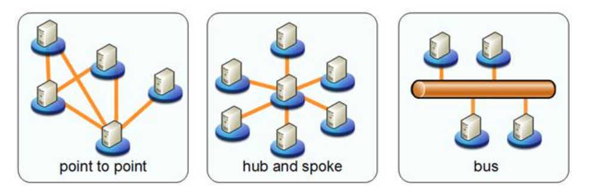

# Integration & Interfaces
This document is to organize key concepts module integration and implementation 

# 0. Index
- **[1. EAI](/Integration_interfaces.md#1-EAI)**
- **[2. ESB](/Integration_interfaces.md#2-ESB)**
- **[3. SOA](/Integration_interfaces.md#3-SOA)**
- **[4. Web serivice](/Integration_interfaces.md#4-web-service)**
- **[5. IPC](/Integration_interfaces.md#5-ipc)**
 
# 1. EAI
EAI represents Enterprise Application Integration

## EAI types

# 2. ESB
An enterprise service bus (ESB) is an architectural pattern whereby a centralized software component performs integrations between applications.

# 3. SOA
Service-oriented architecture (SOA) is a method of software development that uses software components called services to create business applications.

# 4. Web service

## SOAP
Simple Object Access Protocol (SOAP) is a lightweight XML-based protocol that is used for the exchange of information in decentralized, distributed application environments.

## WSDL
WSDL stands for Web Services Description Language; WSDL is used to describe web services; WSDL is written in XML

## UDDI
UDDI stands for Universal Description, Discovery, and Integration.

It serves as a registry for WSDL, providing stadnard access to search and store in the form of WSDL

## JSON

## XML

## AJAX

## REST

# 5. IPC
inter-process communication (IPC), also spelled interprocess communication, are the mechanisms provided by an operating system for processes to manage shared data
- Socket : A socket is one endpoint of a two way communication link between two programs running on the network.
- Semaphore : In computer science, a semaphore is a variable or abstract data type used to control access to a common resource by multiple threads

# Reference
[Link](https://www.peregrineconnect.com/documentation-kb/bus-architecture//)

